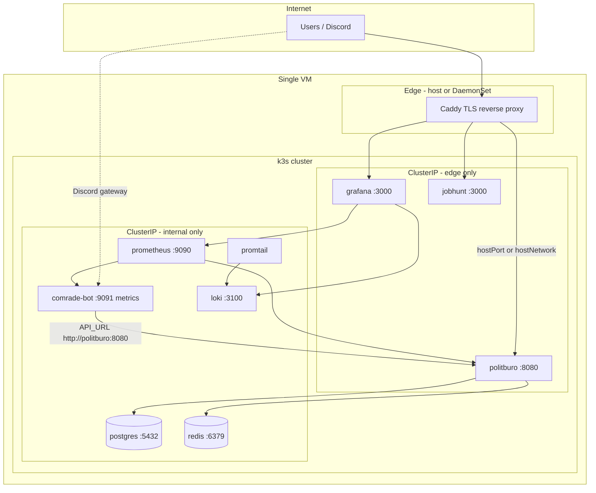

# Production: single-VM Kubernetes (k3s)

**Status:** planned — not implemented  
**Last updated:** 2026-09-02  
**Scope:** migrate `labour-bureau/prod/` from Podman Compose + host Caddy to k3s on one VM

## Goals

1. **Kubernetes-style control plane** on a single VM: declarative manifests, health-driven restarts, rollout primitives, and a clear split between cluster-internal and internet-facing surfaces.
2. **Explicit endpoint exposure** — only ingress (or a dedicated edge proxy) publishes routes; databases, Redis, metrics scrapes, and inter-service calls stay on the cluster network.
3. **Safer deployments** — immutable image tags from CI, `Recreate` rollouts for job-bearing workloads, and readiness gates so traffic only hits healthy pods.
4. **Single active instance** for Politburo (including its scheduler), comrade-bot, Postgres, and Redis. No second pod running jobs, no idempotency workarounds, no active/active replication for now.

## Non-goals (for this phase)

- Multi-node HA or pod autoscaling beyond `replicas: 1`.
- Running two Politburo pods during a rolling update (would duplicate scheduled jobs).
- Replacing CI image builds with on-host `docker build` on the VM.
- Changing application code for leader election or distributed locking.

---

## Current production (baseline)

Today the stack lives in `labour-bureau/prod/`:

| Layer | What runs | Notes |
|---|---|---|
| Orchestration | Podman Compose (`docker-compose.prod.yml`) + `labour-bureau-compose.service` | `restart: unless-stopped` per container |
| Edge | Caddy (rootful systemd unit) | TLS, path-based proxy to `127.0.0.1:8080` / `:3000` / `:3001` |
| Apps | politburo, comrade-bot, jobhunt | Built on deploy host via `deploy-services.sh` |
| Data | Postgres 15, Redis 7 | Compose `internal` network; DB bound to `127.0.0.1:5432` for SSH tunnels |
| Observability | Prometheus, Loki, Promtail, Grafana | Prometheus scrapes by Compose DNS name; Grafana via Caddy |

Public vs internal today is enforced partly by Compose (`expose` vs `ports`) and partly by Caddy (e.g. `/metrics` blocked on `comradebot.cc`). Prometheus, Loki, and Redis have no public ports; Politburo and Grafana are localhost-only and reached through Caddy.

Pain points this plan addresses:

- Compose + separate Caddy + separate log shipper = three operational models.
- `podman compose up --build` on the VM couples deploys to source checkouts and build toolchains.
- Rolling restarts are implicit (`unless-stopped`); there is no first-class readiness → traffic cutover.
- Internal DNS and port publishing are ad hoc compared to Services + NetworkPolicies.

---

## Recommended platform: k3s on one VM

**k3s** is a CNCF-certified, single-binary Kubernetes distribution suited to one server. It bundles:

- API server, scheduler, kubelet, containerd
- **CoreDNS** for in-cluster DNS (`politburo.default.svc.cluster.local`, etc.)
- **local-path-provisioner** for PersistentVolumes on the VM disk (or a mounted volume path)
- Optional **Traefik** ingress (we will **disable** it and keep Caddy — see [Edge routing](#edge-routing))

### Why k3s over “full” Kubernetes

| Concern | k3s on one VM |
|---|---|
| Resource overhead | ~512 MB RAM for control plane; fits a modest VPS |
| Operational complexity | One install command; upgrades are documented |
| “Kubernetes enough” | Services, Deployments, Secrets, Ingress, NetworkPolicy, probes |
| Single node | k3s server mode is the default; no separate worker |

Alternatives considered and deferred:

- **Stay on Compose** — simpler, but does not give Service/Ingress/NetworkPolicy primitives or a uniform rollout API.
- **Nomad** — lighter, but smaller ecosystem for ingress/secrets patterns the team already knows from k8s docs.
- **k0s / microk8s** — viable; k3s wins on documentation volume and single-binary ergonomics for a hobby/small prod VM.

### VM prerequisites (target)

- Ubuntu 22.04+ or similar (current prod uses Podman on Ubuntu)
- ≥ 4 GB RAM (8 GB comfortable with Postgres + observability)
- Mounted data disk (existing `/mnt/HC_Volume_*`) for PV backing store
- Ports 80/443 open for Caddy (unchanged)
- SSH access; **no** Kubernetes API (`6443`) exposed to the internet

Install sketch (execute during migration, not now):

```bash
curl -sfL https://get.k3s.io | INSTALL_K3S_EXEC="server \
  --disable traefik \
  --write-kubeconfig-mode 644" sh -
```

Point `local-path-provisioner` (or a custom StorageClass) at the mounted disk if Postgres data should live off the root volume.

---

## Target architecture



### Namespace layout

| Namespace | Workloads | Rationale |
|---|---|---|
| `ie-apps` | politburo, comrade-bot, jobhunt | Application tier |
| `ie-data` | postgres, redis | Stateful; tighter NetworkPolicy |
| `ie-observability` | prometheus, loki, promtail, grafana | Monitoring; scrape apps via cluster DNS |

Single namespace is acceptable initially; splitting data early makes “deny all ingress to postgres” a one-liner NetworkPolicy.

---

## Endpoint exposure model

Kubernetes does not publish ports by default. Every surface is classified:

### Public (via Caddy → cluster)

| Host | Backend | Paths | Notes |
|---|---|---|---|
| `comradebot.cc` | politburo Service | `/api/*`, `/auth/*`, `/dashboard/*`, `/static/*`, `/public/*`, `/ui/api/*`, `/` | Align Caddy rules with rewrite routes (`/api/v1/...`, `/health/*`) when migrating off legacy paths |
| `monitor.comradebot.cc` | grafana Service | `/*` | WebSocket headers preserved (existing Caddy config) |
| `jobs.comradebot.cc` | jobhunt Service | `/*` | Unchanged intent |

**Blocked at edge (keep current behaviour):**

- `GET /metrics` on public hosts → 403 at Caddy (defence in depth even if app also serves metrics internally)

### Cluster-internal only (ClusterIP, no hostPort)

| Service | Port | Consumers |
|---|---|---|
| `postgres` | 5432 | politburo, jobhunt |
| `redis` | 6379 | politburo |
| `comrade-bot` | — (no HTTP API to internet) | Discord outbound; metrics on 9091 |
| `prometheus` | 9090 | grafana, ops SSH tunnel if needed |
| `loki` | 3100 | grafana, promtail |
| `politburo` `/metrics` | 8080 | prometheus only (not via Caddy) |

### Admin / break-glass (optional, off by default)

| Access | Pattern |
|---|---|
| Postgres admin | `kubectl port-forward svc/postgres 5432:5432` from SSH session — replaces `127.0.0.1:5432` publish |
| Grafana direct | Already public via Caddy; no extra NodePort |
| k3s API | `localhost:6443` only |

### NetworkPolicy (recommended once stable)

Example intent (not literal YAML yet):

- `ie-data/postgres`: allow ingress only from pods labeled `app=politburo` and `app=jobhunt` on 5432.
- `ie-data/redis`: allow ingress only from `app=politburo` on 6379.
- `ie-apps/politburo`: allow ingress from namespace `kube-system` or host Caddy identity on 8080; allow ingress from `ie-observability/prometheus` on `/metrics` if using a dedicated metrics port later.
- Default deny ingress in `ie-data` and `ie-observability` except explicit selectors.

NetworkPolicies require a CNI that enforces them (k3s **flannel** supports basic policy; for stricter rules consider **cilium** later — out of scope for v1).

---

## Single-active-instance guarantees

This is the most important constraint. Politburo runs scheduled jobs when `JOBS_ENABLED=true`. Two pods would mean duplicate syncs unless the app adds leader election.

### Policy

| Workload | `replicas` | Deployment `strategy` | Rationale |
|---|---|---|---|
| politburo | `1` | **`Recreate`** | Old pod must terminate before new pod starts — no overlap |
| comrade-bot | `1` | `Recreate` | One Discord session per bot token |
| jobhunt | `1` | `Recreate` | Avoid duplicate side effects if any cron exists |
| postgres | `1` | StatefulSet, `replicas: 1` | Single writer |
| redis | `1` | StatefulSet or Deployment + PVC | Single instance |
| prometheus, loki, grafana, promtail | `1` each | `Recreate` | Sufficient for single VM |

**Do not use** `RollingUpdate` with `maxSurge: 1` on politburo until the application implements job leader election.

### Probes

Politburo rewrite exposes `/health/live` and `/health/ready` (replace legacy `/healthCheck` in manifests).

```yaml
# Illustrative — politburo Deployment fragment
spec:
  replicas: 1
  strategy:
    type: Recreate
  template:
    spec:
      containers:
        - name: politburo
          readinessProbe:
            httpGet:
              path: /health/ready
              port: 8080
            initialDelaySeconds: 5
            periodSeconds: 10
          livenessProbe:
            httpGet:
              path: /health/live
              port: 8080
            initialDelaySeconds: 15
            periodSeconds: 20
```

`readinessProbe` prevents Caddy (or an in-cluster Ingress) from routing to a pod that cannot reach Postgres/Redis.

### Optional hardening later

- **PodDisruptionBudget** `maxUnavailable: 0` on postgres — reduces voluntary eviction during node maintenance (limited value on a single node, but documents intent).
- **Leader election** in Politburo (e.g. Kubernetes lease or Redis lock) — only needed if we ever raise `replicas` or use `RollingUpdate`.

---

## Edge routing

Two viable patterns; pick one during implementation.

### Option A — Caddy stays on the host (recommended for migration)

- k3s runs workloads with **hostPort** or **hostNetwork** only for services Caddy must reach, **or** Caddy uses `127.0.0.1` → **kube-proxy** via a stable NodePort bound to localhost (e.g. `127.0.0.1:8080` → politburo Service).
- Simplest migration from today’s `Caddyfile` (`reverse_proxy … 127.0.0.1:8080`).
- TLS and Let’s Encrypt stay in the existing `caddy-rootful.service`.

### Option B — Caddy as a Kubernetes DaemonSet

- Caddy pod mounts the same `Caddyfile` ConfigMap and ACME storage PVC.
- `hostNetwork: true` or `LoadBalancer` (not useful on single VM without cloud LB).
- Unified lifecycle with apps but slightly more moving parts for certificate storage.

**Recommendation:** start with **Option A**; move Caddy in-cluster only if host + cluster networking becomes awkward.

---

## Images and deploy workflow

### Build (unchanged philosophy)

CI builds and pushes immutable tags (Git SHA), as described in `docs/development/containers.md`. The VM **pulls** images; it does not build politburo/comrade-bot except for emergencies.

```
ghcr.io/<org>/politburo:<git-sha>
ghcr.io/<org>/comrade-bot:<git-sha>
```

### Deploy on the VM

```bash
# Illustrative
export POLITBURO_IMAGE=ghcr.io/org/politburo:abc1234
kubectl -n ie-apps set image deployment/politburo politburo=$POLITBURO_IMAGE
kubectl -n ie-apps rollout status deployment/politburo
```

Wrap in `labour-bureau/prod/k8s/scripts/deploy-politburo.sh` (future) mirroring today’s `deploy-services.sh` ergonomics.

### Rollback

```bash
kubectl -n ie-apps rollout undo deployment/politburo
```

Because strategy is `Recreate`, rollback also avoids two politburo pods.

---

## Secrets and configuration

Map today’s `prod/env/*.env` files to Kubernetes Secrets and non-secret ConfigMaps.

| Today (`prod/env/`) | Kubernetes | Mount style |
|---|---|---|
| `database.env` | Secret `postgres-credentials` | envFrom or `POSTGRES_PASSWORD` key |
| `cache.env` | Secret `redis-credentials` | env + redis `requirepass` command |
| `politburo.env` | Secret `politburo-secrets` + ConfigMap `politburo-config` | Prefer `*_FILE` mounts per `containers.md` |
| `comrade-bot.env` | Secret `comrade-bot-secrets` | `BOT_TOKEN`, `API_URL=http://politburo.ie-apps.svc:8080` |
| `monitoring.env` | Secret `grafana-admin` | env |

**SOPS + age** (or sealed-secrets) for Git-stored encrypted manifests under `labour-bureau/prod/k8s/` — never commit plaintext Secrets.

`API_URL` for comrade-bot becomes in-cluster DNS:

```
http://politburo.ie-apps.svc.cluster.local:8080
```

No dependency on host loopback or Caddy for bot → API traffic.

---

## Observability migration

| Component | Change from Compose |
|---|---|
| Prometheus | Scrape targets use Kubernetes SD or static cluster DNS (`politburo.ie-apps.svc:8080`, `comrade-bot.ie-apps.svc:9091`) — reuse `prometheus.prod.yml` job names |
| Promtail | DaemonSet (one per node = one pod) collecting container logs via `/var/log/pods` or k3s containerd paths; retire host `podman-log-shipper` |
| Loki | StatefulSet + PVC on mounted disk |
| Grafana | Deployment + PVC; keep provisioning ConfigMaps from `prod/grafana/provisioning/` |
| Node metrics | `prometheus-node-exporter` DaemonSet (replaces standalone node-exporter container if present) |

Politburo `/metrics` remains internal-only; Prometheus scrapes over the cluster network. Caddy continues to block `/metrics` on public hostnames.

---

## Storage

| Data | Provisioner | Size guidance |
|---|---|---|
| Postgres | PVC `local-path` (or custom path on mounted disk) | grow with fleet; snapshot before upgrades |
| Redis AOF | PVC | smaller; backup via RDB/AOF copy |
| Prometheus TSDB | PVC | 30d retention (match current command) |
| Loki | PVC | match `loki.prod.yml` retention |
| Grafana | PVC | dashboards + users |
| Caddy ACME (if in-cluster) | PVC or host bind | certs |

**Backup:** keep `pg_dump` cron on the VM (Job or host systemd timer calling `kubectl exec`). Document restore drill before cutover.

---

## Migration phases

Execute in order; each phase should leave production usable.

### Phase 0 — Prep (no cutover)

- [ ] Add Dockerfiles / CI publish for rewrite politburo image (if not already publishing SHA tags).
- [ ] Create `labour-bureau/prod/k8s/` manifest tree (Kustomize base + `prod` overlay).
- [ ] Install k3s on the VM with Traefik disabled; verify `kubectl get nodes`.
- [ ] Configure registry pull secret on the node.

### Phase 1 — Data plane in cluster

- [ ] Deploy Postgres + Redis to `ie-data` with PVCs on mounted disk.
- [ ] Restore or migrate data from Compose volumes (`pg_dump` / `pg_restore`).
- [ ] Verify politburo **job** connectivity from a throwaway debug pod.

### Phase 2 — Observability in cluster

- [ ] Deploy Prometheus, Loki, Promtail, Grafana.
- [ ] Import dashboards from `prod/grafana/provisioning/`.
- [ ] Point Grafana DNS to new Grafana Service (parallel run or maintenance window).

### Phase 3 — Applications

- [ ] Deploy politburo (`replicas: 1`, `Recreate`, probes on `/health/*`).
- [ ] Deploy comrade-bot with in-cluster `API_URL`.
- [ ] Deploy jobhunt if still in use.
- [ ] Wire Caddy to cluster Services (localhost NodePort or hostPort).
- [ ] Smoke test: Discord commands, `/api/v1` via Caddy, dashboard login, job metrics in Grafana.

### Phase 4 — Decommission Compose

- [ ] Stop `labour-bureau-compose.service`.
- [ ] Archive `docker-compose.prod.yml` with a README pointer to k8s overlays.
- [ ] Remove podman-log-shipper if Promtail DaemonSet subsumes it.
- [ ] Update `labour-bureau/prod/README.md` and `AGENTS.md` deploy instructions.

### Phase 5 — Hardening (optional)

- [ ] NetworkPolicies for `ie-data` and metrics paths.
- [ ] Resource requests/limits per Deployment (prevent OOM killing Postgres silently).
- [ ] Alertmanager or external alerting hook.

---

## Rewrite-specific notes

The Politburo **rewrite** (single `cmd/politburo` binary, default DB `politburo_next`, port `8082` in dev) should be what production images run before or during migration:

| Topic | Action |
|---|---|
| Health paths | Manifests use `/health/live` and `/health/ready`, not legacy `/healthCheck` |
| Port | Container listens on `8080` in prod (configurable via `PORT`); Service targets that port |
| Vizburo | No separate deployment — UI is the same politburo pod |
| Jobs | Single replica + `Recreate` is the operational guarantee; `JOBS_ENABLED=true` only on the one politburo pod |
| Migrations | Run as Kubernetes **Job** before Deployment upgrade, or init container — pick one pattern and document it in `labour-bureau/prod/k8s/README.md` when implementing |

---

## Operational commands (cheat sheet)

```bash
# Cluster health
kubectl get nodes
kubectl get pods -A

# App status
kubectl -n ie-apps get deploy,po,svc
kubectl -n ie-apps logs deploy/politburo -f

# Deploy new politburo build
kubectl -n ie-apps set image deploy/politburo politburo=ghcr.io/org/politburo:<sha>
kubectl -n ie-apps rollout status deploy/politburo

# Emergency rollback
kubectl -n ie-apps rollout undo deploy/politburo

# DB tunnel (replaces localhost:5432 publish)
kubectl -n ie-data port-forward svc/postgres 5432:5432
```

---

## Risks and mitigations

| Risk | Mitigation |
|---|---|
| Two politburo pods during rollout | `strategy: Recreate`; never raise replicas without leader election |
| k3s upgrade breaks workloads | Pin k3s version; snapshot PVCs before upgrade |
| Disk full on local-path volume | Monitor node disk; retention on Loki/Prometheus; move PV base to mounted disk |
| Caddy ↔ cluster networking mismatch | Prototype NodePort-to-localhost in Phase 0; document chosen pattern |
| Secret sprawl in Git | SOPS-encrypted manifests only; `kubectl apply -k` from decrypted CI or on-host |
| Single VM = single point of failure | Accepted; HA is explicitly out of scope |

---

## Repository layout (to create during implementation)

```
labour-bureau/prod/k8s/
  README.md                 # install, deploy, rollback
  base/
    namespaces.yaml
    kustomization.yaml
    apps/
      politburo.yaml
      comrade-bot.yaml
      jobhunt.yaml
    data/
      postgres.yaml
      redis.yaml
    observability/
      prometheus.yaml
      loki.yaml
      promtail.yaml
      grafana.yaml
  overlays/
    prod/
      kustomization.yaml    # images, host paths, replica counts
  scripts/
    deploy-politburo.sh
    deploy-comrade-bot.sh
    migrate-from-compose.sh
```

Politburo application docs stay in `politburo/docs/`; cluster manifests live in `labour-bureau/prod/k8s/` because they orchestrate the whole stack (same as today’s Compose location).

---

## Success criteria

- [ ] One command (`kubectl apply -k overlays/prod` or a thin wrapper) brings up the full stack after a reboot.
- [ ] Politburo deploy replaces the running pod without a period of two job runners.
- [ ] No internet-facing port on Postgres, Redis, Prometheus, or Loki.
- [ ] Public API and dashboard work through Caddy with the same hostnames as today.
- [ ] comrade-bot calls politburo over cluster DNS, not `127.0.0.1`.
- [ ] Grafana dashboards show politburo and comrade-bot metrics after deploy.
- [ ] Rollback of a bad politburo image completes in under five minutes.

---

## References

- Current prod: `labour-bureau/prod/README.md`, `docker-compose.prod.yml`, `Caddyfile`
- Local dev split (Compose backing + host apps): `labour-bureau/README.md`
- Politburo containers and secrets: `politburo/docs/development/containers.md`
- Politburo architecture: `politburo/docs/architecture/overview.md`
- k3s docs: https://docs.k3s.io/
